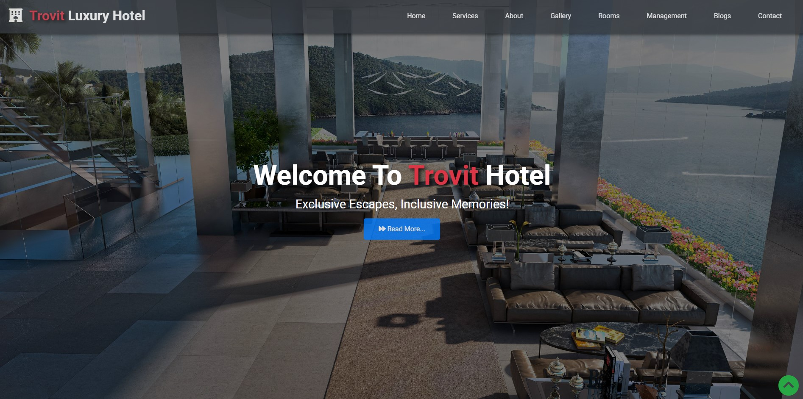
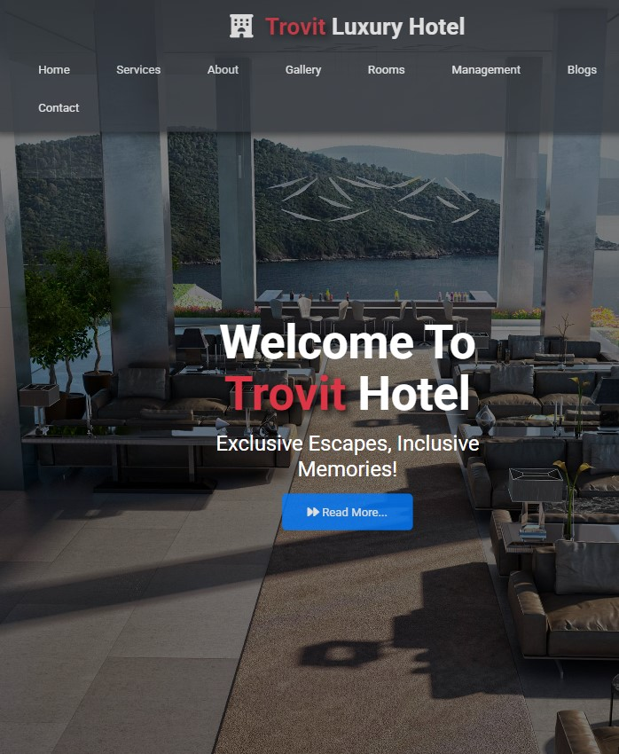

# Hotel Site

This project is a simple web application of a hotel site. The project was developed using HTML and CSS and published using GitHub Pages.

Contents

- [Project URL](#project-urls)
- [Features](#features)
- [Project Content](#project-content)
- [Screenshot](#screenshot)
- [Challenge](#challenge)
- [Technologies-Used](#Technologies-Used)
- [Author](#author)
- [License](#license)
- [Show-Your-Support](#show-your-support)

# Project URL

The project is published at: [Hotel-site](https://mkalkandev.github.io/hotel-site/)

# Features

- **Responsive Design:** Provides a good user experience on mobile devices.
- **Simple and User Friendly Interface:** Provides easy access to recipe information.

- **Modern HTML and CSS Techniques:** Clean and sustainable code structure.

# Project Content

This project contains the following files and folders:

- **index.html:** HTML file for the home page.

- **style.css:** CSS file that creates the design of the project.

- **utils.css:** CSS file that creates the design I use in general projects.

- **responsive.css:** CSS file that creates the responsive design of the project.

- **images/**: Folder containing the images used on the page.

- **icons/**: Folder containing the icons used on the page.

# Screenshot

# Challenge

My app allows users to:

Display the most appropriate layout for the app based on the single screen size of their device
See the navigation states for all interactive elements on the page
ongoing development
This was my seventh project with HTML and CSS and I am happy with the result. Of course there are flaws and imperfections but it will be improved. I tried to structure the HTML better and used flex in CSS and used variables and introduced pseudo element properties. I added a small media query. I added in-page navigation links and an additional blog page.

I plan to continue exploring and learning more about this technology so there will definitely be more projects related to it soon.

# Technologies Used

Operating System

first stage

 

tools

 

# Author

👤MustafaKalkan

Github:<a href="https://github.com/mkalkandev/" target="_blank">@mkalkandev</a>

Front End Mentor:<a href="https://www.frontendmentor.io/profile/mkalkandev" target="_blank">@mkalkandev</a>

# License

📝 Copyright © 2024 MustafaKalkan.

This project is licensed by [MIT](./LICENSE).

# Show your support

If you found this project useful, give it a ⭐️! Have fun building! 🚀
